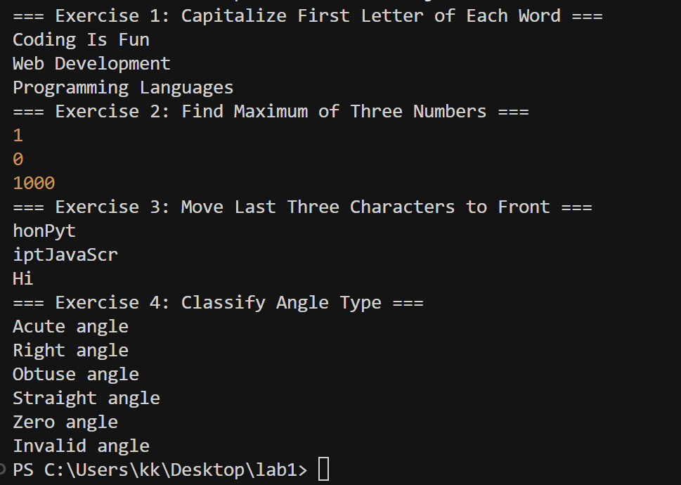
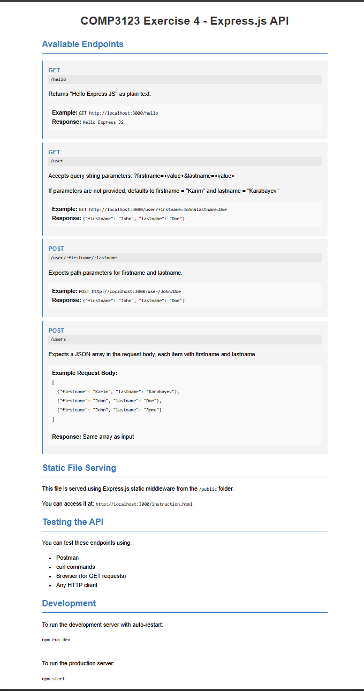
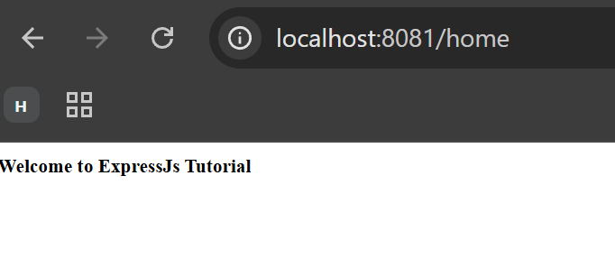
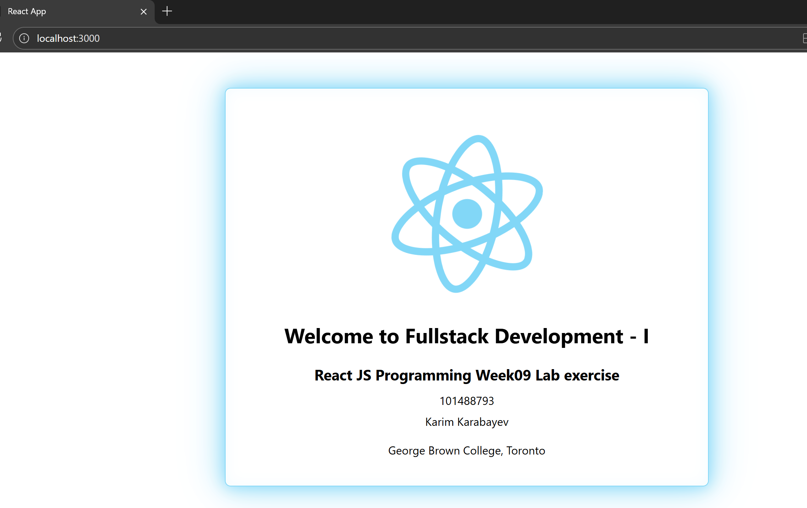

# COMP3123 Missed Labs

**Student ID:** 101488793  
**Student Name:** Karim Karabayev

---

## Lab 1: JavaScript Exercises

### Screenshot

---

## Lab 4: Express.js API Application

### Screenshots

#### API Documentation

#### GET /hello and /user Endpoints
.png)

---

## Lab 5: Express.js Routes and Authentication

### Screenshots

#### GET /home Endpoint

#### GET /profile Endpoint
.png)

#### POST /login (Successful)
.png)

#### POST /login (Invalid Username)
.png)

#### Additional Screenshots
.png)
.png)
.png)

---

## Lab 9: React.js Application

### Screenshot

